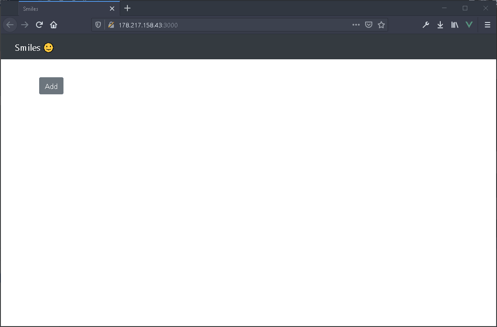

# CRUD Smiles

Bootstrap 4.5/Vue 2.6/Laravel 8 - Simple CRUD app

> Demo [CRUD Smiles](http://178.217.158.43:3000)
> 


### Installation

1. Clone repo

2. Change to directory

````
cd TestWork_50724
````   

3. Install dependencies

````
composer install
````

4. Copy .env file

```
cp .env.example .env
```

5. Create `laravel` in your database.

6. Generate application key:

````
php artisan key:generate
````

7. Migrate
````
php artisan migrate:fresh
````

8. Install Node modules
````
npm install
````

9. Build

````
npm run prod
````

### Installation with Docker

> Inspiration from [https://hub.docker.com/r/bitnami/laravel](https://hub.docker.com/r/bitnami/laravel)


1. Clone repo

2. Change to directory

````
cd TestWork_50724
```` 

3. Download the docker-compose.yml file in the application directory

````
curl -LO https://raw.githubusercontent.com/bitnami/bitnami-docker-laravel/master/docker-compose.yml
````

4. Copy .env file

```
cp .env.example .env
```

5. Launch the Laravel application development environment using:

```
docker-compose up
```
6. Generate application key:
````
docker-compose exec myapp php artisan key:generate
````

7. Migrate
````
docker-compose exec myapp php artisan migrate:fresh
````

8. Install Node modules
````
docker-compose exec myapp npm install
````

9. Build

````
docker-compose exec myapp npm run prod
````
